# Session Analysis Report

## Background Context

Client is a middle-aged man in waste management consulting presenting with recurrent panic attacks, often triggered by seemingly minor events. Reports significant stress from complex family dynamics (demanding mother, rebellious children) and high-pressure business dealings. Expresses difficulty managing anger and frustration, sometimes externalizing blame. Mentions unusual attachment to local wildlife (e.g., ducks). History suggests resistance to emotional vulnerability. Goals: Manage panic attacks, develop healthier coping mechanisms for anger/stress, explore family/interpersonal patterns.

## Dialogue Transcript

#### Turn 1 (THERAPIST)

> Good afternoon, Tony. How are you doing today?

_Modality Events:_

- `Audio Speech Features`: Calm, measured speech rate (Confidence: 0.90)
- `Gaze Direction`: Direct eye contact (Confidence: 0.95)

---

#### Turn 2 (PATIENT)

> eh you know doc same old same old just another day in this thing of ours

_Modality Events:_

- `Audio Emotion`: Slight tension in voice (Confidence: 0.70)
- `Body Pose Gesture`: Slouched posture (Confidence: 0.80)
- `Visual Analysis`: Slouches in chair, avoiding direct eye contact (Confidence: 0.70)

---

#### Turn 3 (THERAPIST)

> I sense some tension in your voice, Tony. Is there something specific on your mind today?

_Modality Events:_

- `Audio Speech Features`: Softened tone (Confidence: 0.85)

---

#### Turn 4 (PATIENT)

> yeah well I had another one of those... you know those fuckin panic attacks or whatever you call em last night it really threw me for a loop

_Modality Events:_

- `Audio Emotion`: Frustration in voice (Confidence: 0.90)
- `Body Pose Gesture`: Hand gesture of dismissal (Confidence: 0.75)
- `Visual Analysis`: Agitated hand movements, shifts uncomfortably in seat (Confidence: 0.80)

---

#### Turn 5 (THERAPIST)

> I'm sorry to hear that, Tony. That must have been distressing. Can you tell me more about what happened leading up to the panic attack?

_Modality Events:_

- `Audio Emotion`: Empathetic tone (Confidence: 0.90)
- `Gaze Direction`: Maintains steady eye contact (Confidence: 0.95)

---

#### Turn 6 (PATIENT)

> it was stupid really I was just sittin there watchin TV and all of a sudden I start thinkin about this meeting I got comin up with these guys from Jersey and next thing I know my heart's racing I can't breathe it's like I'm gonna die or somethin

_Modality Events:_

- `Audio Speech Features`: Increased speech rate (Confidence: 0.85)
- `Body Pose Gesture`: Hand touches chest (Confidence: 0.80)

---

#### Turn 7 (THERAPIST)

> Thank you for sharing that, Tony. It sounds like the thought of the upcoming meeting triggered some intense anxiety. Let's work on a technique that might help you manage those feelings when they come up. Are you open to trying a simple breathing exercise?

_Modality Events:_

- `Audio Speech Features`: Calm, measured pace (Confidence: 0.90)

---

#### Turn 8 (PATIENT)

> I dunno doc I mean breathin exercises? that sounds like some kinda new age crap my wife would be into

_Modality Events:_

- `Audio Emotion`: Skeptical tone (Confidence: 0.80)
- `Facial Expression`: Slight frown (Confidence: 0.70)
- `Visual Analysis`: Rolls eyes slightly, crosses arms defensively (Confidence: 0.75)

---

#### Turn 9 (THERAPIST)

> I understand your skepticism, Tony. But this technique is actually based on solid research. It's a way to activate your body's natural calming response. Think of it as a tool in your arsenal for managing stress. Would you be willing to give it a try, just for a minute?

_Modality Events:_

- `Audio Speech Features`: Persuasive tone (Confidence: 0.85)
- `Gaze Direction`: Maintains eye contact (Confidence: 0.90)

---

#### Turn 10 (PATIENT)

> alright alright I'll try it but I'm tellin you doc if this don't work I'm gonna be real disappointed

_Modality Events:_

- `Audio Emotion`: Resigned tone (Confidence: 0.75)
- `Body Pose Gesture`: Slight shrug (Confidence: 0.70)
- `Visual Analysis`: Sighs visibly, shoulders slump in resignation (Confidence: 0.70)

---

#### Turn 11 (THERAPIST)

> I appreciate your willingness to try, Tony. Now, let's start by taking a deep breath in through your nose for a count of four, hold it for a count of seven, and then exhale slowly through your mouth for a count of eight. Ready?

_Modality Events:_

- `Audio Speech Features`: Slow, calming pace (Confidence: 0.95)

---

#### Turn 12 (PATIENT)

> yeah okay here goes nothin

_Modality Events:_

- `Audio Emotion`: Slight nervousness in voice (Confidence: 0.70)
- `Visual Analysis`: Closes eyes, focuses on breathing with visible chest movements (Confidence: 0.85)

---

#### Turn 13 (THERAPIST)

> Great. Let's do it together. Breathe in... 2... 3... 4... Hold... 2... 3... 4... 5... 6... 7... Now exhale slowly... 2... 3... 4... 5... 6... 7... 8. How do you feel?

_Modality Events:_

- `Audio Speech Features`: Very slow, rhythmic speech (Confidence: 0.95)

---

#### Turn 14 (PATIENT)

> huh that's uh that's actually not bad I mean I feel a little calmer I guess

_Modality Events:_

- `Audio Emotion`: Surprised tone (Confidence: 0.80)
- `Body Pose Gesture`: Shoulders relax slightly (Confidence: 0.70)
- `Visual Analysis`: Eyebrows raise in surprise, posture straightens slightly (Confidence: 0.75)

---

#### Turn 15 (THERAPIST)

> I'm glad you found it helpful, Tony. This is something you can practice regularly, especially when you feel stress building up. Now, I'd like to shift gears a bit. You've mentioned before that your relationship with your mother can be challenging. How have things been on that front?

_Modality Events:_

- `Audio Speech Features`: Gentle transition in tone (Confidence: 0.85)
- `Gaze Direction`: Attentive eye contact (Confidence: 0.90)

---

#### Turn 16 (PATIENT)

> aw jesus doc why'd you have to bring her up? I was just startin to feel better look it's the same as always she's always on my case about somethin or other now she's gettin on me about not visitin enough

_Modality Events:_

- `Audio Emotion`: Irritation in voice (Confidence: 0.90)
- `Body Pose Gesture`: Tenses up (Confidence: 0.80)
- `Visual Analysis`: Tenses visibly, jaw clenches (Confidence: 0.80)
- `Visual Analysis`: Averts gaze, looks towards window or door (Confidence: 0.70)

---

#### Turn 17 (THERAPIST)

> I hear your frustration, Tony. It sounds like you feel a lot of pressure from your mother's expectations. How do you typically respond when she brings up these concerns?

_Modality Events:_

- `Audio Emotion`: Empathetic tone (Confidence: 0.90)

---

#### Turn 18 (PATIENT)

> what am I supposed to do? I tell her to lay off I got a business to run I can't be runnin over there every five minutes just cause she's lonely or whatever

_Modality Events:_

- `Audio Emotion`: Defensive tone (Confidence: 0.85)
- `Body Pose Gesture`: Crosses arms (Confidence: 0.80)
- `Visual Analysis`: Leans forward aggressively, gestures emphatically (Confidence: 0.75)

---

#### Turn 19 (THERAPIST)

> I understand you feel pulled in different directions, Tony. It's a common struggle. Have you considered that your mother's requests might be her way of expressing that she misses you? Perhaps we could explore some ways to set boundaries while still maintaining a connection.

_Modality Events:_

- `Audio Speech Features`: Gentle, probing tone (Confidence: 0.85)

---

#### Turn 20 (PATIENT)

> boundaries? with my mother? doc you don't know her she'd never go for that she'd probably have a heart attack if I tried to set a boundary

_Modality Events:_

- `Audio Emotion`: Incredulous tone (Confidence: 0.80)
- `Facial Expression`: Raises eyebrows (Confidence: 0.70)
- `Visual Analysis`: Shakes head in disbelief, throws hands up slightly (Confidence: 0.70)

---

#### Turn 21 (THERAPIST)

> I hear your concern, Tony. Setting boundaries can be challenging, especially with family. But it's an important skill for managing stress and maintaining healthy relationships. What if we brainstormed some small steps you could take to start establishing some boundaries?

_Modality Events:_

- `Audio Speech Features`: Encouraging tone (Confidence: 0.90)
- `Gaze Direction`: Maintains steady eye contact (Confidence: 0.95)

---

#### Turn 22 (PATIENT)

> I dunno doc maybe I guess we could try but I'm tellin you it ain't gonna be easy

_Modality Events:_

- `Audio Emotion`: Slight uncertainty in voice (Confidence: 0.70)
- `Body Pose Gesture`: Slight head shake (Confidence: 0.60)
- `Visual Analysis`: Scratches head thoughtfully, posture softens slightly (Confidence: 0.65)

---

#### Turn 23 (THERAPIST)

> I appreciate your openness to try, Tony. You're right, it won't be easy, but I believe it could really help reduce your stress. For this week, could you try scheduling a specific time to call your mother? This way, you're initiating contact on your terms.

_Modality Events:_

- `Audio Speech Features`: Supportive tone (Confidence: 0.90)

---

#### Turn 24 (PATIENT)

> alright alright I'll give it a shot but if this blows up in my face I'm blamin you doc

_Modality Events:_

- `Audio Emotion`: Mix of resignation and humor (Confidence: 0.80)
- `Facial Expression`: Slight smirk (Confidence: 0.70)
- `Visual Analysis`: Half-smiles, shrugs shoulders lightly (Confidence: 0.70)

---

#### Turn 25 (THERAPIST)

> I understand, Tony. We'll review how it goes in our next session. Before we wrap up, let's summarize. We've practiced a breathing technique for managing panic attacks, and you're going to try scheduling calls with your mother. Is there anything else you'd like to address before we end?

_Modality Events:_

- `Audio Speech Features`: Summarizing tone (Confidence: 0.90)
- `Gaze Direction`: Shifts gaze briefly to notes (Confidence: 0.80)

---

#### Turn 26 (PATIENT)

> nah I think that's enough for today doc my head's already spinnin with all this stuff

_Modality Events:_

- `Audio Emotion`: Fatigue in voice (Confidence: 0.75)
- `Body Pose Gesture`: Leans back in chair (Confidence: 0.80)
- `Visual Analysis`: Rubs temples, leans back heavily in chair (Confidence: 0.75)

---

#### Turn 27 (THERAPIST)

> I understand, Tony. We've covered a lot today. Remember to practice that breathing technique when you feel stressed, and let's touch base next week about how the scheduled call with your mother went. Take care, and I'll see you next time.

---

## Session Timeline

```mermaid
timeline
    title Tony's Therapy Session: Anxiety and Family Dynamics
    section Opening and Recent Events
        Turn 1 (T) : Greeting and check-in ; Gaze: Direct
        Turn 2 (P) : Expressing daily monotony ; Posture: Slouched ; Gaze: Avoidant
        Turn 3 (T) : Probing patient's tension ; TO: Validation
        Turn 4 (P) : Reporting recent panic attack ; Emotion: Frustration ; KM: Panic disclosure
    section Exploring Anxiety and Coping Strategies
        Turn 5 (T) : Inquiring about panic attack details ; TO: Empathy
        Turn 6 (P) : Describing panic attack experience ; KM: Anxiety trigger ; Gesture: Chest touch
        Turn 7 (T) : Suggesting breathing exercise ; TO: Coping strategy
        Turn 8 (P) : Expressing skepticism about exercise ; Emotion: Skeptical ; Gesture: Eye roll
        Turn 9 (T) : Explaining benefits of technique ; TO: Psychoeducation
        Turn 10 (P) : Reluctantly agreeing to try ; Posture: Resigned
        Turn 11 (T) : Guiding through breathing exercise ; Speech: Slow, calming
        Turn 12 (P) : Preparing for exercise ; Visual: Focused breathing
        Turn 13 (T) : Leading breathing exercise ; Speech: Rhythmic
        Turn 14 (P) : Expressing surprise at effectiveness ; KM: Strategy acceptance ; Posture: Relaxed
    section Addressing Family Dynamics
        Turn 15 (T) : Transitioning to mother relationship ; TO: Topic shift
        Turn 16 (P) : Reacting negatively to mother topic ; Emotion: Irritation ; KM: Family stress
        Turn 17 (T) : Exploring patient's frustration ; TO: Empathy
        Turn 18 (P) : Expressing difficulty with mother's demands ; Posture: Defensive ; Gesture: Emphatic
        Turn 19 (T) : Suggesting alternative perspective ; TO: Reframing
        Turn 20 (P) : Doubting boundary-setting possibility ; Emotion: Incredulous ; Gesture: Disbelief
        Turn 21 (T) : Encouraging small boundary-setting steps ; TO: Encouragement
        Turn 22 (P) : Cautiously considering boundary-setting ; Posture: Softened
        Turn 23 (T) : Suggesting scheduled calls strategy ; TO: Strategy proposal
        Turn 24 (P) : Agreeing to try new approach ; Emotion: Humor ; KM: Willingness
    section Closing and Next Steps
        Turn 25 (T) : Summarizing session and plans ; TO: Session review
        Turn 26 (P) : Expressing session fatigue ; Posture: Leaning back ; Gesture: Temple rub
        Turn 27 (T) : Concluding and setting expectations
```

## Session Analysis

### Overall Summary

The session focused on addressing Tony's recent panic attack and exploring his challenging relationship with his mother. Progress was made in introducing a breathing technique for anxiety management, which Tony found surprisingly helpful. The therapist employed validation, psychoeducation, and gentle probing to explore Tony's resistance to setting boundaries with his mother. Key areas for future focus include consistent practice of coping skills for anxiety, further exploration of family dynamics, and gradual implementation of boundary-setting strategies.

### Identified Themes

- **Theme:** Anxiety management and panic attacks
  - _Summary:_ Tony reported a recent panic attack triggered by thoughts of an upcoming meeting. The therapist introduced a breathing exercise, which Tony initially resisted but ultimately found helpful.
  - _Evidence:_ [Turn 4 (PATIENT)](#turn-4-patient), [Turn 5 (THERAPIST)](#turn-5-therapist), [Turn 6 (PATIENT)](#turn-6-patient), [Turn 7 (THERAPIST)](#turn-7-therapist), [Turn 8 (PATIENT)](#turn-8-patient), [Turn 12 (PATIENT)](#turn-12-patient), [Turn 13 (THERAPIST)](#turn-13-therapist), [Turn 14 (PATIENT)](#turn-14-patient)
- **Theme:** Challenging relationship with mother
  - _Summary:_ Tony expressed frustration about his mother's demands for more frequent visits. He showed resistance to setting boundaries, believing his mother wouldn't accept them.
  - _Evidence:_ [Turn 16 (PATIENT)](#turn-16-patient), [Turn 17 (THERAPIST)](#turn-17-therapist), [Turn 18 (PATIENT)](#turn-18-patient), [Turn 19 (THERAPIST)](#turn-19-therapist), [Turn 20 (PATIENT)](#turn-20-patient), [Turn 21 (THERAPIST)](#turn-21-therapist)
- **Theme:** Resistance to vulnerability and new techniques
  - _Summary:_ Tony initially dismissed the breathing exercise as 'new age crap' and expressed skepticism about setting boundaries with his mother, showing a pattern of resistance to new approaches.
  - _Evidence:_ [Turn 8 (PATIENT)](#turn-8-patient), [Turn 9 (THERAPIST)](#turn-9-therapist), [Turn 10 (PATIENT)](#turn-10-patient), [Turn 11 (THERAPIST)](#turn-11-therapist), [Turn 20 (PATIENT)](#turn-20-patient), [Turn 21 (THERAPIST)](#turn-21-therapist)

### Key Moments

- **Moment (related to [Turn 6 (PATIENT)](#turn-6-patient)):** Patient vividly described a recent panic attack, providing insight into his anxiety triggers and physical symptoms.
  - _Dialogue Snippet:_ "it was stupid really I was just sittin there watchin TV and all of a sudden I start thinkin about this meeting I got comin up with these guys from Jersey and next thing I know my heart's racing I can't breathe it's like I'm gonna die or somethin"
  - _Relevant Events:_
    - `Audio Speech Features`: Increased speech rate (Confidence: 0.85)
    - `Body Pose Gesture`: Hand touches chest (Confidence: 0.80)
- **Moment (related to [Turn 14 (PATIENT)](#turn-14-patient)):** Patient showed surprise at the effectiveness of the breathing exercise, indicating a shift in his openness to new coping strategies.
  - _Dialogue Snippet:_ "huh that's uh that's actually not bad I mean I feel a little calmer I guess"
  - _Relevant Events:_
    - `Audio Emotion`: Surprised tone (Confidence: 0.80)
    - `Body Pose Gesture`: Shoulders relax slightly (Confidence: 0.70)
    - `Visual Analysis`: Eyebrows raise in surprise, posture straightens slightly (Confidence: 0.75)
- **Moment (related to [Turn 17 (THERAPIST)](#turn-17-therapist)):** Patient displayed strong emotional reaction when discussing his mother, indicating a significant source of stress.
  - _Dialogue Snippet:_ "aw jesus doc why'd you have to bring her up? I was just startin to feel better look it's the same as always she's always on my case about somethin or other now she's gettin on me about not visitin enough"
  - _Relevant Events:_
    - `Audio Emotion`: Irritation in voice (Confidence: 0.90)
    - `Body Pose Gesture`: Tenses up (Confidence: 0.80)
    - `Visual Analysis`: Tenses visibly, jaw clenches (Confidence: 0.80)
    - `Visual Analysis`: Averts gaze, looks towards window or door (Confidence: 0.70)

### Therapeutic Observations

- **Observation (related to [Turn 7 (THERAPIST)](#turn-7-therapist)):** Therapist used validation and empathy to acknowledge patient's distress
  - _Evidence Summary:_ Therapist expressed empathy and encouraged further exploration of the panic attack experience
  - _Evidence Links:_ [Turn 7 (THERAPIST)](#turn-7-therapist)
- **Observation (related to [Turn 9 (THERAPIST)](#turn-9-therapist)):** Therapist provided psychoeducation on breathing techniques for anxiety management
  - _Evidence Summary:_ Therapist explained the scientific basis for breathing exercises and framed it as a tool for stress management
  - _Evidence Links:_ [Turn 9 (THERAPIST)](#turn-9-therapist)
- **Observation (related to [Turn 14 (PATIENT)](#turn-14-patient)):** Patient demonstrated openness to new coping strategy, showing progress in anxiety management
  - _Evidence Summary:_ Patient expressed surprise at the effectiveness of the breathing exercise and acknowledged feeling calmer
  - _Evidence Links:_ [Turn 14 (PATIENT)](#turn-14-patient)
- **Observation (related to [Turn 19 (THERAPIST)](#turn-19-therapist)):** Therapist used reframing to help patient consider alternative perspectives on mother's behavior
  - _Evidence Summary:_ Therapist suggested mother's requests might be expressions of missing the patient, encouraging empathy and connection
  - _Evidence Links:_ [Turn 19 (THERAPIST)](#turn-19-therapist)
- **Observation (related to [Turn 24 (PATIENT)](#turn-24-patient)):** Patient showed willingness to attempt boundary-setting, indicating progress in addressing family dynamics
  - _Evidence Summary:_ Patient agreed to try scheduling specific call times with his mother, despite initial resistance
  - _Evidence Links:_ [Turn 24 (PATIENT)](#turn-24-patient)
