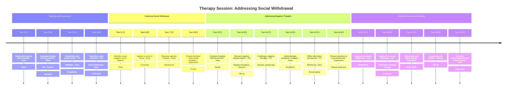

# Session Analysis Report

## Background Context

Client is a university student in their early 20s presenting with symptoms of mild depression, including persistent low mood, loss of interest in previously enjoyed activities (socializing, hobbies), low energy, and increased isolation. Reports difficulty concentrating on studies and feelings of hopelessness about the future. Family history of depression. Goals: Behavioral activation, identifying and challenging negative thought patterns, improving social connection, exploring coping strategies for low mood.

## Dialogue Transcript

#### Turn 1 (THERAPIST)

> Hello Alex, it's good to see you today. How have you been feeling since our last session?

_Modality Events:_

- `Audio Speech Features`: Slow, measured speech rate
- `Gaze Direction`: Direct eye contact

---

#### Turn 2 (PATIENT)

> um not great to be honest i've been feeling pretty low and just kinda stuck in my room most of the time

_Modality Events:_

- `Audio Emotion`: Flat affect in voice (Confidence: 0.80)
- `Body Pose Gesture`: Shoulders slightly hunched
- `Visual Analysis`: Slumped posture, minimal eye contact (Confidence: 0.70)

---

#### Turn 3 (THERAPIST)

> I'm sorry to hear you've been feeling low. Thank you for sharing that with me. Can you tell me more about what you mean by feeling stuck in your room?

_Modality Events:_

- `Audio Emotion`: Warm, empathetic tone (Confidence: 0.90)

---

#### Turn 4 (PATIENT)

> yeah i guess i've just been avoiding going out or talking to people it feels like too much effort and i don't know what to say anyway

_Modality Events:_

- `Gaze Direction`: Glances downward
- `Body Pose Gesture`: Hand fidgeting
- `Visual Analysis`: Averted gaze, slight head tilt downward (Confidence: 0.60)

---

#### Turn 5 (THERAPIST)

> It sounds like you're experiencing some social withdrawal, which is common with depression. Would you like to focus on this today and explore ways to gradually increase your social interactions?

_Modality Events:_

- `Audio Speech Features`: Clear, steady speech

---

#### Turn 6 (PATIENT)

> i guess so yeah it's probably something i should work on

_Modality Events:_

- `Audio Emotion`: Slight uncertainty in voice (Confidence: 0.70)
- `Visual Analysis`: Subtle nod, brief glance at therapist (Confidence: 0.50)

---

#### Turn 7 (THERAPIST)

> Alright, let's start by looking at a specific instance. Can you tell me about a recent time when you chose not to engage in a social activity?

_Modality Events:_

- `Gaze Direction`: Maintains eye contact

---

#### Turn 8 (PATIENT)

> um well my roommate invited me to go to a study group yesterday but i said no and just stayed in my room

_Modality Events:_

- `Facial Expression`: Slight frown
- `Visual Analysis`: Furrows brow slightly, shifts in seat (Confidence: 0.60)

---

#### Turn 9 (THERAPIST)

> I see. What thoughts were going through your mind when you decided not to go?

_Modality Events:_

- `Audio Speech Features`: Gentle, inquiring tone

---

#### Turn 10 (PATIENT)

> i guess i thought it would be awkward and that i wouldn't have anything useful to contribute anyway so what's the point

_Modality Events:_

- `Body Pose Gesture`: Slight shrug
- `Visual Analysis`: Shrugs shoulders, maintains downward gaze (Confidence: 0.70)

---

#### Turn 11 (THERAPIST)

> Those thoughts sound quite negative and self-critical. Let's examine them more closely. What evidence do you have that you wouldn't have anything useful to contribute?

_Modality Events:_

- `Audio Speech Features`: Slightly slower speech rate

---

#### Turn 12 (PATIENT)

> i don't know i guess i haven't been keeping up with the readings as much as i should

_Modality Events:_

- `Gaze Direction`: Brief eye contact avoidance
- `Visual Analysis`: Briefly looks up at therapist, then away (Confidence: 0.60)

---

#### Turn 13 (THERAPIST)

> I hear you're concerned about not being fully prepared. But even if you haven't done all the readings, could there still be value in attending? Perhaps for asking questions or learning from others?

_Modality Events:_

- `Audio Emotion`: Encouraging tone (Confidence: 0.80)

---

#### Turn 14 (PATIENT)

> yeah i guess that's true i hadn't really thought about it that way

_Modality Events:_

- `Facial Expression`: Slight raised eyebrows
- `Visual Analysis`: Slight head tilt, fleeting eye contact (Confidence: 0.50)

---

#### Turn 15 (THERAPIST)

> That's great that you're open to considering a different perspective. For homework this week, could you try attending one small social event, even if you don't feel fully prepared? It could be something simple like a short study session or a quick coffee with a classmate.

_Modality Events:_

- `Audio Speech Features`: Upbeat, motivational tone

---

#### Turn 16 (PATIENT)

> okay i think i could try that maybe i'll see if my roommate wants to grab coffee sometime

_Modality Events:_

- `Audio Emotion`: Slight increase in vocal energy (Confidence: 0.70)
- `Visual Analysis`: Nods slowly, uncrosses arms (Confidence: 0.60)
- `Visual Analysis`: Slight upward curve of mouth corners (Confidence: 0.50)

---

#### Turn 17 (THERAPIST)

> That sounds like a great plan, Alex. I'm proud of you for being willing to take this step. Remember, the goal is simply to engage, not to have a perfect interaction. We'll talk about how it went in our next session. Is there anything else you'd like to discuss before we wrap up?

_Modality Events:_

- `Facial Expression`: Warm smile
- `Gaze Direction`: Sustained eye contact

---

#### Turn 18 (PATIENT)

> no i think that's good for today thanks

_Modality Events:_

- `Body Pose Gesture`: Slight forward lean
- `Visual Analysis`: Sits up straighter, makes brief eye contact (Confidence: 0.70)

---

#### Turn 19 (THERAPIST)

> You're welcome, Alex. Remember, small steps can lead to big changes. I believe in you, and I'm here to support you. Take care, and I'll see you next week.

_Modality Events:_

- `Audio Emotion`: Supportive, warm tone (Confidence: 0.90)

---

## Session Timeline

## Session Analysis

### Overall Summary

The session focused on addressing the patient's social withdrawal and negative self-perception, symptoms of their mild depression. The therapist effectively used Socratic questioning and reframing techniques to challenge negative thoughts and encourage behavioral activation. The patient showed openness to new perspectives and agreed to attempt social engagement as homework. Progress was evident in the patient's willingness to consider alternative viewpoints and commit to a small social interaction. Future focus may include building on this momentum to further increase social activities and continue challenging negative thought patterns.

### Identified Themes

- **Theme:** Social withdrawal and isolation
  - _Summary:_ Patient reported feeling 'stuck' in their room, avoiding social interactions, and declining invitations. This was supported by verbal statements and nonverbal cues such as slumped posture and minimal eye contact.
  - _Evidence:_ [Turn 2 (PATIENT)](#turn-2-patient), [Turn 4 (PATIENT)](#turn-4-patient), [Turn 6 (PATIENT)](#turn-6-patient), [Turn 8 (PATIENT)](#turn-8-patient)
- **Theme:** Negative self-perception and low self-efficacy
  - _Summary:_ Patient expressed beliefs about not having anything useful to contribute and questioning the point of social engagement. This was evident in their verbal statements and accompanying body language such as shrugging and downward gaze.
  - _Evidence:_ [Turn 10 (PATIENT)](#turn-10-patient), [Turn 12 (PATIENT)](#turn-12-patient)
- **Theme:** Difficulty with academic engagement
  - _Summary:_ Patient mentioned not keeping up with readings as much as they should, indicating struggles with academic responsibilities.
  - _Evidence:_ [Turn 12 (PATIENT)](#turn-12-patient)

### Key Moments

- **Moment (related to [Turn 4 (PATIENT)](#turn-4-patient)):** Patient elaborated on social withdrawal, providing specific examples of avoidance behavior.
  - _Dialogue Snippet:_ "yeah i guess i've just been avoiding going out or talking to people it feels like too much effort and i don't know what to say anyway"
  - _Relevant Events:_
    - `Gaze Direction`: Glances downward
    - `Body Pose Gesture`: Hand fidgeting
    - `Visual Analysis`: Averted gaze, slight head tilt downward (Confidence: 0.60)
- **Moment (related to [Turn 10 (PATIENT)](#turn-10-patient)):** Patient revealed negative thought patterns related to social interactions.
  - _Dialogue Snippet:_ "i guess i thought it would be awkward and that i wouldn't have anything useful to contribute anyway so what's the point"
  - _Relevant Events:_
    - `Body Pose Gesture`: Slight shrug
    - `Visual Analysis`: Shrugs shoulders, maintains downward gaze (Confidence: 0.70)
- **Moment (related to [Turn 16 (PATIENT)](#turn-16-patient)):** Patient showed openness to considering a different perspective on social engagement.
  - _Dialogue Snippet:_ "okay i think i could try that maybe i'll see if my roommate wants to grab coffee sometime"
  - _Relevant Events:_
    - `Audio Emotion`: Slight increase in vocal energy (Confidence: 0.70)
    - `Visual Analysis`: Nods slowly, uncrosses arms (Confidence: 0.60)
    - `Visual Analysis`: Slight upward curve of mouth corners (Confidence: 0.50)

### Therapeutic Observations

- **Observation (related to [Turn 6 (PATIENT)](#turn-6-patient)):** Therapist used validation and empathy to acknowledge patient's experiences
  - _Evidence Summary:_ Therapist validated patient's feelings and normalized their experience of social withdrawal as common with depression
  - _Evidence Links:_ [Turn 6 (PATIENT)](#turn-6-patient)
- **Observation (related to [Turn 12 (PATIENT)](#turn-12-patient)):** Therapist employed Socratic questioning to challenge negative thoughts
  - _Evidence Summary:_ Therapist asked for evidence supporting patient's belief about not having anything useful to contribute
  - _Evidence Links:_ [Turn 12 (PATIENT)](#turn-12-patient)
- **Observation (related to [Turn 14 (PATIENT)](#turn-14-patient)):** Therapist used reframing technique to offer alternative perspective on social engagement
  - _Evidence Summary:_ Therapist suggested potential value in attending study group even if not fully prepared
  - _Evidence Links:_ [Turn 14 (PATIENT)](#turn-14-patient)
- **Observation (related to [Turn 16 (PATIENT)](#turn-16-patient)):** Patient demonstrated willingness to challenge avoidance behaviors
  - _Evidence Summary:_ Patient agreed to try attending a small social event as homework
  - _Evidence Links:_ [Turn 16 (PATIENT)](#turn-16-patient)
