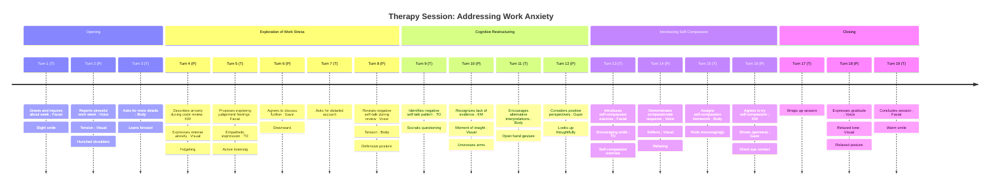

# Session Analysis Report

## Background Context

Client is a software engineer in their late 20s presenting with high-functioning anxiety and significant imposter syndrome. They describe constant worry about code quality, fear of criticism during code reviews, and difficulty accepting positive feedback. Avoids taking on challenging projects. Reports disrupted sleep and muscle tension. Goals: Manage anxiety symptoms, challenge imposter syndrome beliefs (cognitive restructuring), increase self-compassion, develop assertive communication skills.

## Dialogue Transcript

#### Turn 1 (THERAPIST)

> Hello Alex, it's good to see you. How has your week been?

_Modality Events:_

- `Facial Expression`: Slight smile

---

#### Turn 2 (PATIENT)

> Hi Dr. Chen. Uh, it's been okay I guess. Work's been pretty stressful though.

_Modality Events:_

- `Audio Emotion`: Tension in voice (Confidence: 0.80)
- `Gaze Direction`: Brief eye contact
- `Visual Analysis`: Shoulders slightly hunched, avoiding direct eye contact (Confidence: 0.70)

---

#### Turn 3 (THERAPIST)

> I'm sorry to hear work has been stressful. Can you tell me more about what's been going on?

_Modality Events:_

- `Body Pose Gesture`: Leans forward slightly

---

#### Turn 4 (PATIENT)

> Well, we had this big code review yesterday for a project I've been working on. And I just... I don't know, I felt like everyone was judging me the whole time. Like they were all thinking how terrible my code was.

_Modality Events:_

- `Audio Speech Features`: Speaking rate increases (Confidence: 0.70)
- `Body Pose Gesture`: Hands fidgeting
- `Visual Analysis`: Increased fidgeting, eyes darting around the room (Confidence: 0.80)
- `Visual Analysis`: Furrowed brow, tense facial expression (Confidence: 0.75)

---

#### Turn 5 (THERAPIST)

> That sounds like a challenging experience. You mentioned feeling judged during the code review. I'm wondering if we could explore that a bit more today. How does that sound?

_Modality Events:_

- `Facial Expression`: Empathetic expression

---

#### Turn 6 (PATIENT)

> Yeah, I guess that would be okay. I mean, it's been on my mind a lot.

_Modality Events:_

- `Gaze Direction`: Glances downward
- `Visual Analysis`: Slight nod, maintains downward gaze (Confidence: 0.60)

---

#### Turn 7 (THERAPIST)

> Alright, let's focus on that then. Can you walk me through what happened during the code review, and what thoughts were going through your mind?

---

#### Turn 8 (PATIENT)

> So, I was presenting this new feature I'd been working on. And as I was going through it, I kept thinking 'They're going to find so many mistakes' or 'They probably think this is such amateur code.' Even when they were giving positive feedback, I was sure they were just being nice.

_Modality Events:_

- `Audio Emotion`: Tension in voice (Confidence: 0.90)
- `Body Pose Gesture`: Shoulders hunched
- `Visual Analysis`: Arms crossed defensively, leaning back slightly (Confidence: 0.70)

---

#### Turn 9 (THERAPIST)

> I hear a lot of negative self-talk in those thoughts. It sounds like you were interpreting the situation in a way that reinforced your fears. Let's try to examine these thoughts more closely. What evidence do you have that your colleagues were thinking your code was 'amateur'?

_Modality Events:_

- `Audio Speech Features`: Slower, deliberate speech (Confidence: 0.80)

---

#### Turn 10 (PATIENT)

> I mean... I guess I don't have any direct evidence. They didn't actually say anything like that. But I just felt like they must be thinking it.

_Modality Events:_

- `Facial Expression`: Brow furrowed
- `Visual Analysis`: Uncrosses arms, leans forward slightly (Confidence: 0.65)

---

#### Turn 11 (THERAPIST)

> That's an important realization, Alex. You're recognizing that these thoughts aren't based on concrete evidence. They're assumptions your mind is making. What if we tried to come up with some alternative interpretations of their reactions?

_Modality Events:_

- `Body Pose Gesture`: Open hand gesture

---

#### Turn 12 (PATIENT)

> I guess... maybe they were actually interested in the feature? Or maybe they really did think some parts were good?

_Modality Events:_

- `Audio Speech Features`: Hesitant tone (Confidence: 0.70)
- `Gaze Direction`: Looks up thoughtfully
- `Visual Analysis`: Thoughtful expression, hand on chin (Confidence: 0.60)

---

#### Turn 13 (THERAPIST)

> Those are great alternative perspectives, Alex. It's often helpful to challenge our automatic negative thoughts like this. Now, I'd like to introduce a brief self-compassion exercise. Can you think of how you might speak to a friend who was in your situation?

_Modality Events:_

- `Facial Expression`: Encouraging smile

---

#### Turn 14 (PATIENT)

> Um, I'd probably tell them that it's normal to feel nervous during code reviews. And that they're a good developer even if their code isn't perfect.

_Modality Events:_

- `Audio Emotion`: Voice softens (Confidence: 0.60)
- `Visual Analysis`: Softening of facial features, shoulders relaxing (Confidence: 0.70)

---

#### Turn 15 (THERAPIST)

> That's a wonderfully compassionate response, Alex. For homework this week, I'd like you to practice extending that same kindness to yourself. When you notice self-critical thoughts, try to respond as you would to a friend. How does that sound?

_Modality Events:_

- `Body Pose Gesture`: Nods encouragingly

---

#### Turn 16 (PATIENT)

> I can try that. It might be hard, but I'll give it a shot.

_Modality Events:_

- `Facial Expression`: Slight smile
- `Gaze Direction`: Direct eye contact
- `Visual Analysis`: Small encouraging nod, posture more open (Confidence: 0.65)

---

#### Turn 17 (THERAPIST)

> That's great, Alex. Remember, it's a practice. We'll review how it went next session. Is there anything else you'd like to discuss before we wrap up?

---

#### Turn 18 (PATIENT)

> No, I think that covers it. Thanks, Dr. Chen.

_Modality Events:_

- `Audio Emotion`: Relaxed tone (Confidence: 0.80)
- `Visual Analysis`: Relaxed posture, genuine smile (Confidence: 0.75)

---

#### Turn 19 (THERAPIST)

> You're welcome, Alex. I look forward to seeing you next week. Take care.

_Modality Events:_

- `Facial Expression`: Warm smile

---

## Session Timeline

## Session Analysis

### Overall Summary

The session focused on Alex's anxiety and imposter syndrome related to work, particularly a recent code review. The therapist used cognitive restructuring techniques to help Alex challenge negative thoughts and introduced a self-compassion exercise. Alex showed some progress in recognizing the lack of evidence for negative assumptions and demonstrated openness to practicing self-compassion. Future sessions may continue to reinforce cognitive restructuring and self-compassion skills, while addressing underlying anxiety and building confidence in professional abilities.

### Identified Themes

- **Theme:** Work-related anxiety and stress
  - _Summary:_ Alex reported work being stressful and described feeling judged during a code review, with physical signs of tension observed.
  - _Evidence:_ [Turn 2 (PATIENT)](#turn-2-patient), [Turn 4 (PATIENT)](#turn-4-patient), [Turn 8 (PATIENT)](#turn-8-patient)
- **Theme:** Imposter syndrome and negative self-talk
  - _Summary:_ Alex expressed thoughts of being perceived as amateur and doubting positive feedback, indicating strong imposter syndrome feelings.
  - _Evidence:_ [Turn 8 (PATIENT)](#turn-8-patient), [Turn 10 (PATIENT)](#turn-10-patient)
- **Theme:** Cognitive restructuring and challenging negative thoughts
  - _Summary:_ The therapist guided Alex to examine evidence for negative thoughts and consider alternative interpretations of colleagues' reactions.
  - _Evidence:_ [Turn 10 (PATIENT)](#turn-10-patient), [Turn 12 (PATIENT)](#turn-12-patient), [Turn 14 (PATIENT)](#turn-14-patient)
- **Theme:** Self-compassion development
  - _Summary:_ The therapist introduced a self-compassion exercise, and Alex demonstrated the ability to show compassion to others in similar situations.
  - _Evidence:_ [Turn 14 (PATIENT)](#turn-14-patient), [Turn 16 (PATIENT)](#turn-16-patient), [Turn 18 (PATIENT)](#turn-18-patient)

### Key Moments

- **Moment (related to [Turn 4 (PATIENT)](#turn-4-patient)):** Alex expresses intense anxiety about the code review, showing physical signs of distress.
  - _Dialogue Snippet:_ "I felt like everyone was judging me the whole time. Like they were all thinking how terrible my code was."
  - _Relevant Events:_
    - `Audio Speech Features`: Speaking rate increases (Confidence: 0.70)
    - `Visual Analysis`: Increased fidgeting, eyes darting around the room (Confidence: 0.80)
    - `Visual Analysis`: Furrowed brow, tense facial expression (Confidence: 0.75)
- **Moment (related to [Turn 10 (PATIENT)](#turn-10-patient)):** Alex recognizes lack of evidence for negative thoughts, showing a moment of insight.
  - _Dialogue Snippet:_ "I guess I don't have any direct evidence. They didn't actually say anything like that. But I just felt like they must be thinking it."
  - _Relevant Events:_
    - `Facial Expression`: Brow furrowed
    - `Visual Analysis`: Uncrosses arms, leans forward slightly (Confidence: 0.65)
- **Moment (related to [Turn 18 (PATIENT)](#turn-18-patient)):** Alex shows openness to practicing self-compassion, with visible signs of relaxation.
  - _Dialogue Snippet:_ "I can try that. It might be hard, but I'll give it a shot."
  - _Relevant Events:_
    - `Facial Expression`: Slight smile
    - `Gaze Direction`: Direct eye contact
    - `Visual Analysis`: Small encouraging nod, posture more open (Confidence: 0.65)

### Therapeutic Observations

- **Observation (related to [Turn 6 (PATIENT)](#turn-6-patient)):** Therapist uses active listening and validation techniques
  - _Evidence Summary:_ Therapist acknowledges client's feelings and asks for permission to explore the topic further
- **Observation (related to [Turn 10 (PATIENT)](#turn-10-patient)):** Therapist employs Socratic questioning to challenge negative thoughts
  - _Evidence Summary:_ Therapist asks for evidence of Alex's negative assumptions about colleagues' thoughts
- **Observation (related to [Turn 12 (PATIENT)](#turn-12-patient)):** Client demonstrates ability to generate alternative perspectives
  - _Evidence Summary:_ Alex suggests possible positive interpretations of colleagues' reactions
  - _Evidence Links:_ [Turn 12 (PATIENT)](#turn-12-patient)
- **Observation (related to [Turn 14 (PATIENT)](#turn-14-patient)):** Therapist introduces self-compassion exercise
  - _Evidence Summary:_ Therapist asks Alex to consider how they would speak to a friend in a similar situation
- **Observation (related to [Turn 16 (PATIENT)](#turn-16-patient)):** Client shows progress in applying self-compassion concepts
  - _Evidence Summary:_ Alex provides a compassionate response for a hypothetical friend, showing understanding of the concept
  - _Evidence Links:_ [Turn 16 (PATIENT)](#turn-16-patient)
